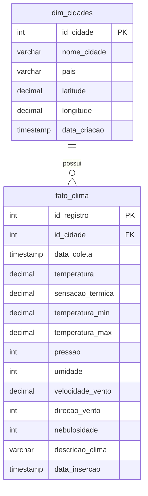

# Star Schema - Weather Data Pipeline

Modelagem dimensional do banco de dados usando Star Schema.

## Descrição das Tabelas

### 📊 dim_cidades (Dimensão)
Tabela de dimensão que armazena informações sobre as cidades monitoradas.
- Dados relativamente estáticos
- Cada cidade tem um ID único

### 📈 fato_clima (Fato)
Tabela de fatos que armazena as métricas climáticas coletadas.
- Dados dinâmicos (cresce com o tempo)
- Relacionada com dim_cidades via id_cidade

## Relacionamento
- **1:N** - Uma cidade pode ter múltiplos registros climáticos
- A chave estrangeira `id_cidade` conecta as tabelas